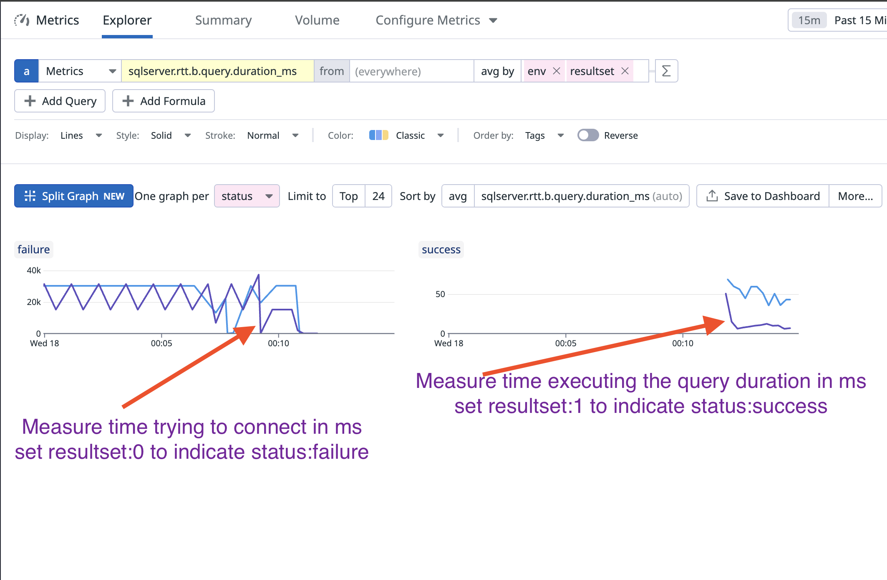
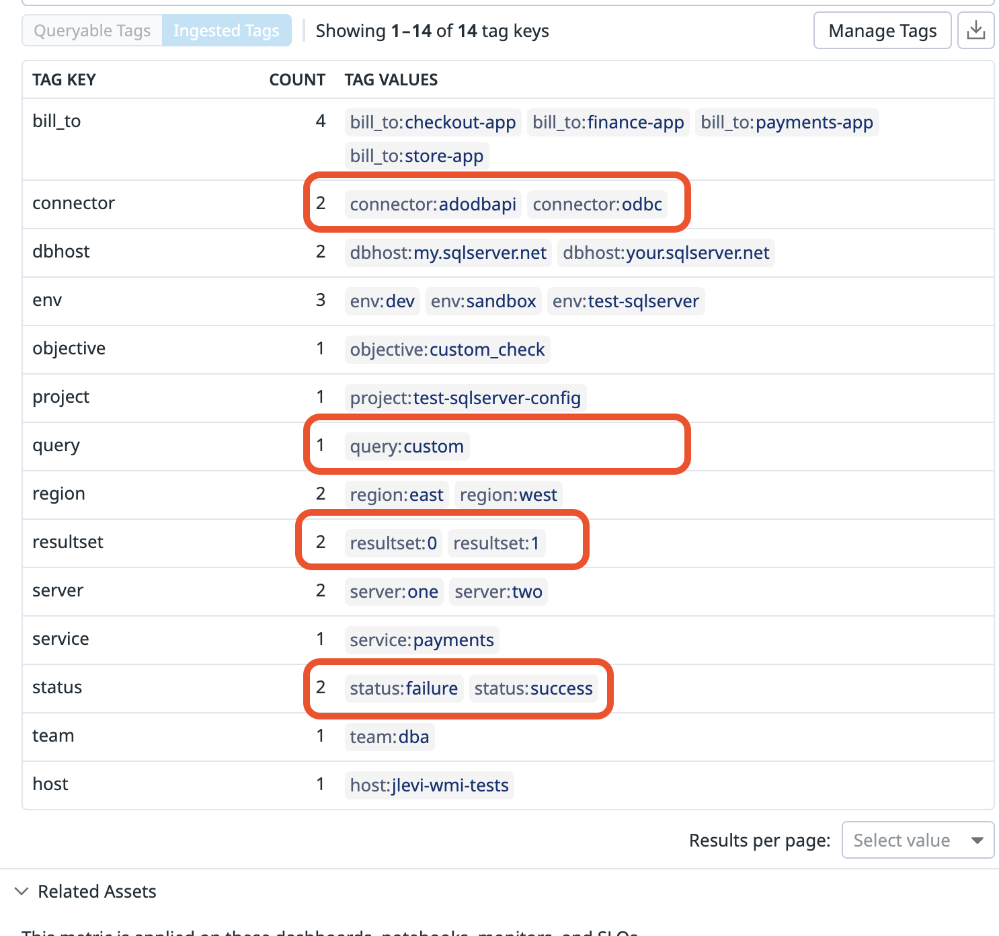
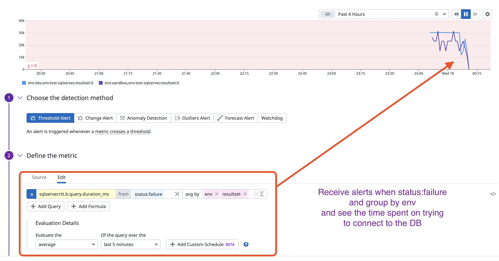
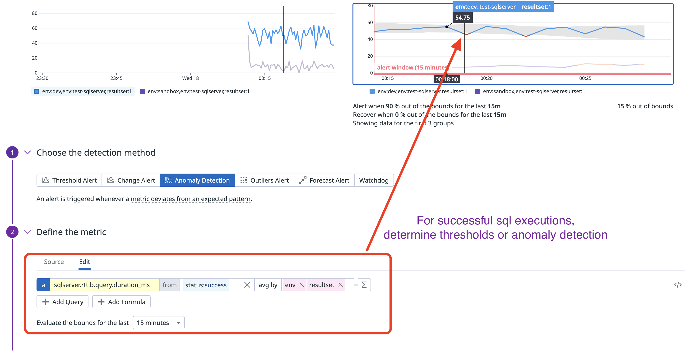

# ADO, ODBC, SQL Server Custom Check in Datadog

* Install both the `conf.yaml` and `sqlserver_rtt.py`
* Divide metrics by `failure` or `success`
  
* Use metrics generated by the `conf.yaml` to create monitors
  
* create a monitor for the failures with rtt
  
* create a monitor for success with rtt
  
