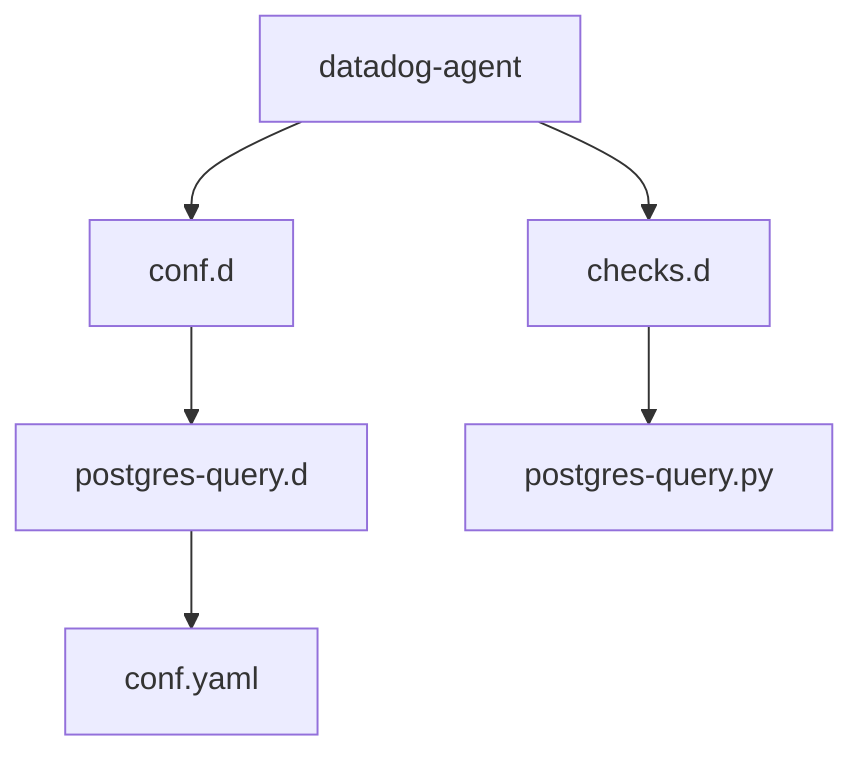

# PostgreSQL Custom Check for Datadog Agent

This custom check allows you to monitor PostgreSQL databases by executing custom SQL queries and reporting the results as metrics to Datadog. The check supports multiple database instances and various query types.

## Directory Structure



## Prerequisites

- Datadog Agent >= 7.x+
- Python 3.x
- `psycopg2` package is included in the Datadog Agent package
- PostgreSQL database access credentials

## Installation

1. Copy the check file to the Datadog Agent's `checks.d` directory:
   ```bash
   sudo cp checks.d/postgres-query.py /etc/datadog-agent/checks.d/
   ```

2. Copy the configuration file to the Datadog Agent's `conf.d` directory:
   ```bash
   sudo cp -r conf.d/postgres-query.d /etc/datadog-agent/conf.d/
   ```

3. Edit the configuration file at `/etc/datadog-agent/conf.d/postgres-query.d/conf.yaml` to add your database credentials and custom queries.

4. Restart the Datadog Agent:
   ```bash
   sudo systemctl restart datadog-agent
   ```

## Configuration

The configuration file (`conf.yaml`) supports multiple database instances and queries. Here's the structure:

```yaml
init_config:
  # Global configuration settings

instances:
  - host: localhost
    port: 5432
    username: datadog
    password: <PASSWORD>
    dbname: database1
    min_collection_interval: 60  # Collection interval in seconds
    timezone: UTC  # Explicitly set timezone for time-based queries
    tags:
      - environment:production
      - service:postgres-main
    queries:
      - query: |
          SELECT count(*) as metric_value
          FROM your_table
          WHERE condition = true
        metric_name: custom.postgres.metric_name
        type: gauge  # or count
        tags:
          - metric_type:performance
```

### Configuration Parameters

- `host`: PostgreSQL server hostname
- `port`: PostgreSQL server port
- `username`: Database user with appropriate permissions
- `password`: User password
- `dbname`: Database name to monitor
- `min_collection_interval`: How often to run the check (in seconds)
- `timezone`: Timezone for time-based queries
- `tags`: Global tags applied to all metrics from this instance

### Query Configuration

- `query`: SQL query that returns a single numeric value
- `metric_name`: Name of the metric in Datadog
- `type`: Metric type (gauge or count)
- `tags`: Additional tags specific to this query

## Validation

To validate the check configuration:

```bash
sudo -u dd-agent datadog-agent check postgres-query
```

## Metrics

The check will submit metrics with the namespace `custom.postgres.query` followed by the metric name specified in your configuration.

## Troubleshooting

1. Check the agent status:
   ```bash
   sudo datadog-agent status
   ```

2. Review the agent logs:
   ```bash
   sudo tail -f /var/log/datadog/agent.log
   ```

3. Common issues:
   - Database connection failures: Verify credentials and network connectivity
   - Query errors: Test queries directly in PostgreSQL first
   - Missing metrics: Ensure queries return numeric values

## Support

For issues or questions about this custom check:

1. Review the Datadog Agent troubleshooting guide in [Writing a Custom Datadog Agent Check](https://docs.datadoghq.com/developers/custom_checks/write_agent_check/)
2. Check the Datadog community forums
3. Contact Datadog support with the agent status and logs