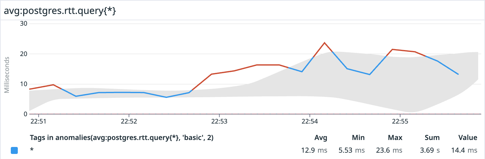

# Round Trip Taken

Measure the round trip from the Datadog agent perspective to the Database and forward metrics to the Datadog SaaS platform


Directory structure:

```
# Custom check goes in the checks.d directory
$DATADOG_PATH/checks.d/rtt_postgres.py


# The YAML config goes in 
$DATADOG_PATH/conf.d/rtt_postgres.d/conf.yaml

# Test the new postgres RTT check with the following
datadog-agent check rtt_postgres
```

* Use the following query to obtain anomalies in the queries, which can also be used in a monitor

```sql
anomalies(avg:postgres.rtt.query{*}, 'basic', 2)
```

results:


