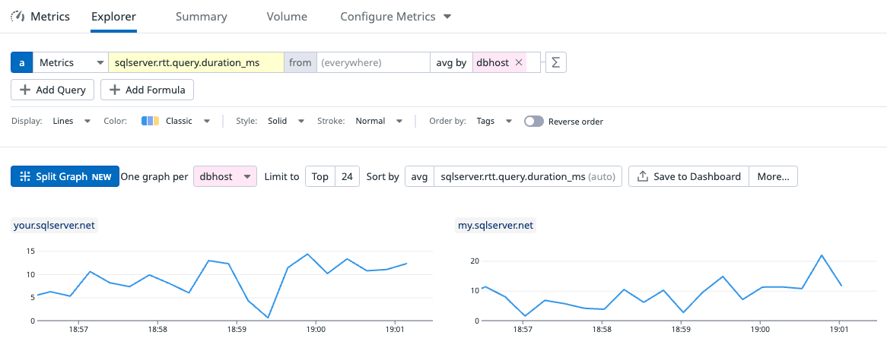

# Round Trip Taken: Datadog Custom Check for SQL Server

Measure the round trip from the Datadog agent perspective to the Database and forward metrics to the Datadog SaaS platform.


Directory structure:

```
# Custom check goes in the checks.d directory
$DATADOG_PATH/checks.d/sqlserver_rtt.py


# The YAML config goes in 
$DATADOG_PATH/conf.d/sqlserver_rtt.d/conf.yaml

# Test the SQL Server RTT check in Linux
sudo datadog-agent check sqlserver_rtt

# Test the SQL Server RTT check in Windows PowerShell
 & "$env:ProgramFiles\Datadog\Datadog Agent\bin\agent.exe" check  sqlserver_rtt
```

* Query is available in metrics explorer:


* Register the metric in Metrics Summary to assign the metrics type as milliseconds


* Use the following query to obtain anomalies in the queries, which can also be used in a monitor

```sql
anomalies(avg:sqlserver.rtt.query.duration_ms{*}, 'basic', 2)
```

results:


